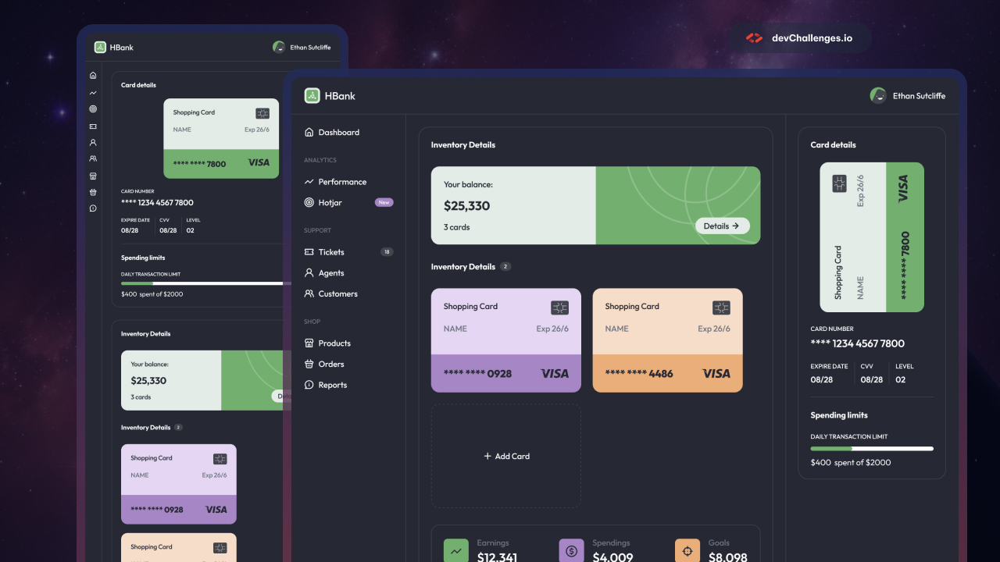

# HBank Dashboard

A banking dashboard UI built with vanilla HTML and CSS. No frameworks, no JavaScript, no build tools. Just markup, styles, and a stubborn refusal to reach for a dependency.



View the **[Project Creators](https://devchallenges.io/)** or explore the **[Live Demo](https://madebytheo.github.io/hbank-dashboard/)**.

## Backstory

By day I work on trading applications built on top of the JSE. The kind of projects that have been running for years, will keep running for years, and will probably never be called _done_. There's something deeply unglamorous about never shipping a finished thing.

HBank is the one of the few personal project I've actually taken from first commit to deployment. Usually the hype fades, or something goes sideways in development, and I just delete the repo without a second thought before the project has even seen the light of day. Not this time.

The brief came from **[devChallenges](https://devchallenges.io/challenge/bank-dashboard-challenge-hbank)**. I took the design, used it as a reference, and made my own calls where I felt like it. Some things got normalized, some things probably should have been and weren't. That's a v2 problem.

## What's HBank?

HBank is a **Demo Banking Dashboard**. The numbers are made up, the cards are placeholders, and clicking anything interactive won't do much, but it _looks_ like something you'd actually log into. The layout handles screens from mobile all the way up to large desktop, the components have micro-interactions baked in, and the whole thing is built on a proper design token foundation using CSS custom properties.

Nothing on this page is real. It's purely a UI exercise.

## Technical Overview

**Stack**: HTML5, CSS3. That's it.

The architecture follows a **Component Driven Approach**. Each UI element (badge, button, bank card, stat, nav link, balance widget, user profile) lives in its own file under `components/` before being composed into `index.html`. Breaking the problem down this way is what made the whole thing manageable. Big problems are just a lot of small problems stacked on top of each other.

### Design System

All design decisions live as CSS custom properties in `:root`. Colours, spacing scale, typography scale, border radiuses, transition durations. Touching the design means touching variables, not hunting through stylesheets.

```css
:root {
  /* colors */
  --color-neutral-900
  --color-neutral-800
  --color-neutral-700
  --color-white
  --color-off-white
  --color-green-100
  --color-green-500
  --color-orange-100
  --color-orange-500
  --color-purple-100
  --color-purple-500
  /* font sizes */
  --text-10
  --text-16
  --text-20
  --text-24
  /* font */
  --weight-400
  --weight-500
  --weight-700
  --weight-800
  --line-height
  --rest-line-height
  /* spacing */
  --space-2
  --space-4
  --space-8
  --space-12
  --space-16
  --space-20
  --space-24
  --space-36
  --space-40
  /* radius */
  --radius-s
  --radius-m
  --radius-l
  --radius-f
  /* borders */
  --layout-border
  --active-border
  --dashed-border
  /* random */
  --font-stack
  --avatar-size
  --mobile-touch-target
  --duration-fast
  --press-scale
  --button-icon-width
  --bank-card-max-width
  --bank-card-min-height
  --progress-bar-height
  /* layout */
  --grid-rows
  --grid-cols
  --no-overflow
  --auto-overflow
  --width-f
  --height-f
  --min-height-f
}
```

### Responsive Layout

The app shell is a CSS Grid with a sticky header and a scrollable main area. The sidebar collapses to icon-only below `1024px`, labels and section headings appear as the viewport grows. The main content area switches from a stacked single-column layout to a side-by-side arrangement at `820px`. Nothing reaches for JavaScript to do any of this.

### Accessibility

Semantic landmarks (`<header>`, `<nav>`, `<main>`, `<section>`), `aria-label` attributes on nav links and regions, visible focus styles using `box-shadow` instead of `outline` so they respect border-radius, and `alt` text handled per element type. There's still room to improve here, it's on the list.

### Micro-Interactions

- Nav links have a subtle green tint on hover (real hover devices only, via `@media (hover: hover) and (pointer: fine)`)
- The Details button arrow nudges right on hover and active
- All interactive elements scale down slightly on `:active` for a physical press feel
- Transitions are kept short at 180ms so nothing feels sluggish

### AI-Assisted Commit

The side navigation was built using GPT-5.4 (via GitHub Copilot Agent mode). Afterwards I spent time reading through everything it produced, understanding it, and making tweaks to get it exactly where I wanted it. The lesson: agents can accelerate you, but you still need to own the code. If you don't understand what landed in your codebase you're going to feel lost in it later.

## Project Structure

```
.
└── hbank-dashboard/
    ├── assets/
    │   ├── fonts/  # self hosted Outfit (400, 500, 700, 800)
    │   ├── icons/  # SVG icon set
    │   └── images/ # user avatars and showcase image
    ├── components/ # isolated component markup files
    │   ├── badge.html
    │   ├── balance.html
    │   ├── bank-card.html
    │   ├── button.html
    │   ├── nav-group.html
    │   ├── nav-link.html
    │   ├── stat.html
    │   └── user-profile.html
    ├── index.html
    └── styles.css
```

## Running Locally

No build step, no `npm install`, no config files to wrangle.

```bash
git clone https://github.com/madebytheo/hbank-dashboard.git
cd hbank-dashboard
```

Open `index.html` in a browser. Done.

## What's Next? (v2 Thinking)

- **Content Overhaul**: Replace all placeholder data with something that actually tells a coherent story
- **Design System Refresh**: revisit the colour palette, spacing scale, and border radiuses to make it feel more distinctly mine
- **`320px` Support**: currently usable on small screens (`375px`+) but not _dialled in_ at the smallest end
- **Demo JS Mode**: A lightweight script that intercepts clicks on interactive elements and surfaces a "this is a demo" message, so the micro-interactions stay intact without confusing anyone

## Built With

- **[Outfit](https://fonts.google.com/specimen/Outfit)**: Typeface by On Type, self-hosted
- **[Josh Comeau's CSS Reset](https://www.joshwcomeau.com/css/custom-css-reset/)**: The CSS reset
- **[DevChallenges](https://devchallenges.io)**: Challenge creators
